# I Introduction

 

​	Currently, computers with von Neumann architecture composed of traditional CMOS (Complementary Metal Oxide Semiconductor) chips often face the serious limitation of ‘memory wall’ when training neural networks, i.e., due to the large amount of data exchange between processor memory, which generates huge energy consumption, and slow computing speed, often unable to effectively handle real-time data.

​	So far, the main categories of memristor-based neural networks are memristor bridge synaptic neural networks and crossbar array neural network circuits. The weights of an MCA (memristor crossbar array) neural network are related to the conductance values of the memristors. Compared with the memristor bridge neural network circuit, the synaptic and overall network circuit structure of this type of neural network are simpler. Two memristors are used to form the crossbar array, and the synaptic weights are the difference of the two array memristor values, so that the weights can be positive, zero, or negative, which makes it easy to update the weights. The circuit structure of crossbar arrays is usually utilized, which allows interconnection of neurons and realization of neural networks with very large integration density. The overall neural network circuit uses a current mode approach to sum multiple output currents.

​	The MCA has a special structure that allows for the simulation of matrix multiplication and convolutional operations, which are the core of AI (artificial intelligence) algorithms, to achieve integrated storage and computation. The crossbar matrix circuit has a memory calculation function at the crossbar, where data storage and operation can be performed at the same point. However, considering the parasitic effect of capacitors, for very large-scale cross-matrix simulation, the commonly used general-purpose circuit simulator SPICE (Simulation Program with Integrated Circuit Emphasis) is very slow, and most of the simulations for cross-switched array circuits mainly focus on the estimation of switching levels such as area power consumption, not carrying out very accurate simulations, and cannot model their functions well in simulation calculations.

​     Existing cross-array simulators, such as MNSIM, mainly skip the SPICE-level circuit simulation and use highly simplified behavioral-level models to simulate the characteristics of memristors and crossbar arrays. It essentially increases the simulation speed by sacrificing accuracy, and thus does not guarantee simulation accuracy and makes it difficult to perform design optimization for complex practical applications. Therefore, the main objective of this essay is to develop dedicated circuit simulation acceleration techniques and tools for the characteristics of MCA using tensor-based technology to improve the simulation efficiency by one order of magnitude, and to realize the design and optimization of memristor neural networks based on circuit simulation. Specifically, we hope to make full use of the special topology of the memristor array and build a corresponding preconditioner based on the tensor to accelerate the core iterative linear system solution process in the simulation process and achieve the optimal balance of simulation speed and accuracy.

 

# II. Architecture of MCA Circuit

 

## *A.*    *Physical MCA Circuit Architecture*

 

  Fig. 1. showcases a general architecture of MCA. The conductance of each memristor device store a matrix element or weight. Usually the voltage-controlled extended memristor is applied to the array since voltages with changeable input pulse lengths and amplitudes are easy-controlled by source meter, without requirement of high accuracy.

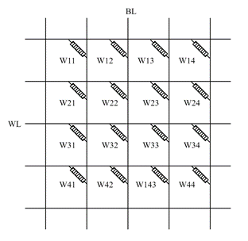

Fig. 1. A general MCA is shown with BL (bit line) and WL (word line).

​     A voltage-controlled extended memristor is illustrated by the following equation:

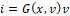

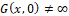

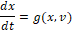

​     Where the  is the resistance state of each memristor, and  is the voltage that applied to both ends.  is the current that we can obtain from measurement. Conductance of memristor  is a function related to  and , which shows a similar property of Ohm’s Law. The state equation  is a function  connected with  and .

​     In Fig .1., analog input vector values are mapping to the voltage with alterable pulse lengths and amplitudes voltages, and the output vector values are represented as currents.

​     The operation of MCA is divided into two parts, writing process and reading process. As there are no insulation between reading and writing, crosstalk is existed in the circuit, which we would not pay attention to in this article.

 

## *B.*    *Numerical Description*

 

​     In a SPICE model, the crossbar array circuits are commonly illustrated by matrix.

​     In the MCA, due to the special characteristics of the circuit, the conductance in the circuit can be reduced to a matrix  in the form of cross point, and since cross point can only form conductance and interact with adjacent cross point, this special characteristic leads to a matrix in the form of a tri-diagonal matrix.

| 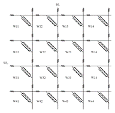  (a) | 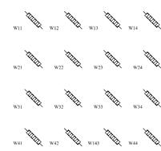  (b) |
| ------------------------------------------------------------ | ------------------------------------------------------------ |
| 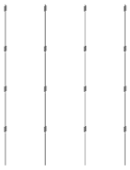  (c) | 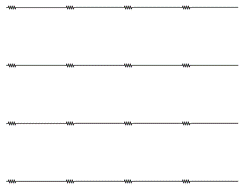  (d) |

Fig. 2. (a) The general MCA with wire resistance concerned, forming 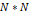 dimension crossbar structure. (b) The division of memristor.  (c) A division of row wire resistance, which can be represented as 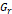. (d) A division of column wire resistance, which can be represented as 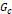. 

Fig. 2(a) shows that in actual, wire conductance is concerned in case of large accuracy error. Fig 2(b), Fig 2(c) and Fig 2(d) showcase the separation of the general MCA structure. The 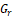 and 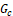 are the conductance of rows and columns, in the matrix form. Given an assumption that every wire resistance is identical, is represented in the graph as resistors. Hence, the  and  matrix are congruent, represented by  instead.

We give our model by the following MNA (Modified Nodal Analysis) equation:

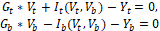

where the  and  in subscript represented top layer and bottom layer of an MCA.  and 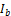 are function that related to voltage applied to the nodes from bottom and top wire, a set of nonlinear equations.  is an array of the top nodal voltages arranged by rows, as well as 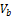.

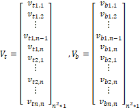

The 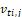 and 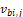 represent the nodal voltage of the 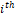 row and 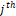 column on the top and bottom grid, respectively.

The G represent the wire conductance matrix in MNA.

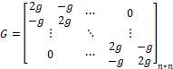

 

Additionally,

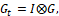

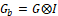

where 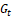 and 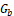 are matrix of 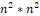 dimension, since  is identity matrix of 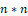.

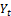 and 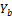 are the nonideal properties in the circuit of top layer and bottom layer, usually the writing and reading noise and thermal noise.

 

## *C.*   *Coupling Model*

 

Since both layer’s nodal voltage in MCA will affect the memristor respectively, it is a non-linear relationship, so we couple the two equations. Combining the two equations into one matrix better for machine solving. A coupled matrix equation is proposed here:

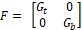***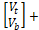 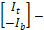 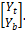

 

To approach the result of equation

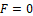

Newton-Raphson method is applied, in every iteration:

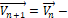 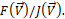

The Jacobian matrix of 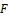 is 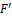:

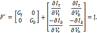

Then,

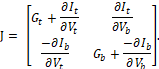

Hence the equation becomes to:

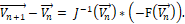

Further get:

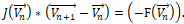

In this function, to show more intuitively in 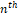 every step of iteration, we make the simplification of the following symbols:

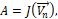

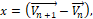

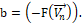

The equation of our primary concern has been transformed into:

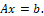

 

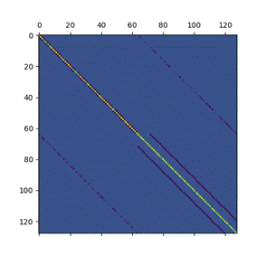

Fig. 3. Schematic diagram of the shape of matrix A when 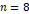. It should be noted that the dimension of the matrix here is 

 

# III. The Accelerator Design on Solution

 

In this section, we mainly focus on using the iterative solution method of GMRES (Generalized minimal residual method) to solve the problem of solving the sparse diagonal matrix. Fig. 3 show a case when the crossbar dimension n is 8, forming a sparse band matrix with dimension 128. Typically, the band matrix we can approximately treat as a seven-diagonal-band matrix, thought there are some vacancies. A preconditioner  is required for the GMRES methods, for better solving process. 

